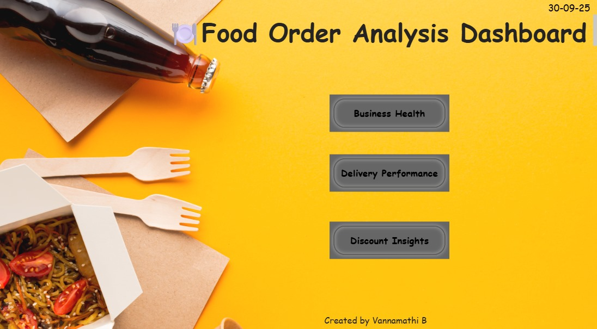
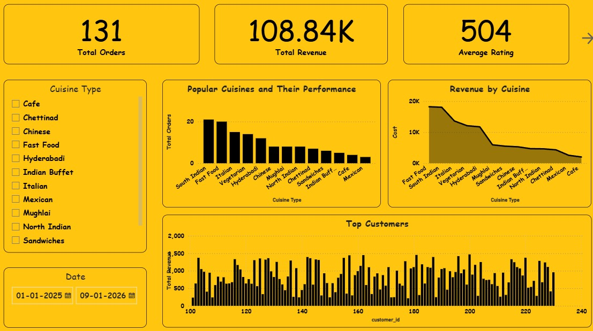
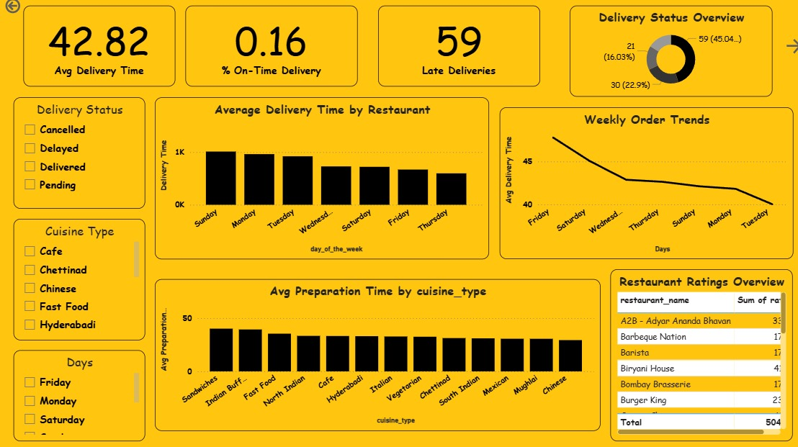
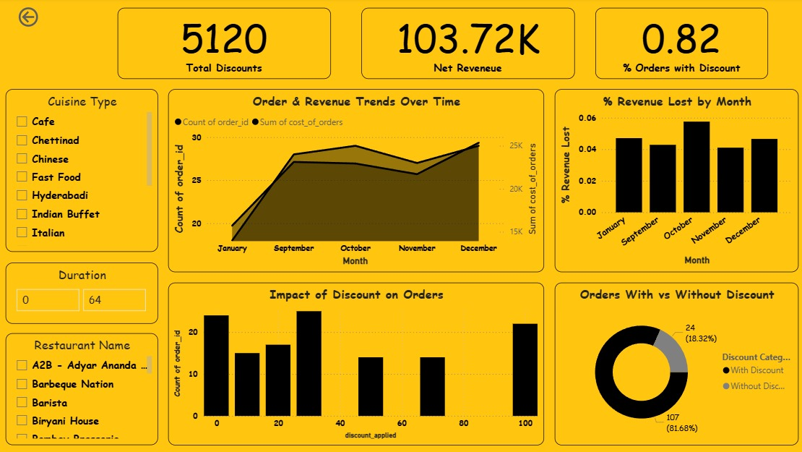

# 🍴 Food Order Analysis Dashboard (Power BI)

## 📌 Project Overview
This project analyzes a **Food Ordering dataset** using **Power BI** to provide insights into:
- Business performance (Orders, Revenue, Ratings)
- Delivery efficiency (On-time vs Late deliveries, Average delivery time)
- Discount impact on revenue and customer behavior

The dashboard is interactive, visually appealing, and designed for **data-driven decision making**.

---

## 🗂 Dataset Details
The dataset contains the following columns:
- **order_id** – Unique order identifier  
- **customer_id** – Customer reference  
- **restaurant_name** – Restaurant fulfilling the order  
- **cuisine_type** – Cuisine category (e.g., Indian, Italian, Chinese)  
- **order_datetime** – Date and time of the order  
- **day_of_the_week** – Day the order was placed  
- **cost_of_orders** – Total cost of the order  
- **discount_applied** – Discount value applied (if any)  
- **delivery_status** – On-time or Late delivery  
- **delivery_time** – Time taken for delivery  
- **food_preparation_time** – Time taken to prepare the order  
- **rating** – Customer feedback rating  

---

## 📊 Dashboard Pages

### 🏠 **Home Page**
- Title & Navigation Buttons (Business Health, Delivery, Discount)
- Today’s Date Card (Dynamic using DAX)
- Easy navigation for end-users  

---

### 📈 **Business Health**
- **KPIs**: Total Orders, Total Revenue, Average Rating, Unique Customers  
- **Orders by Cuisine** – Popular cuisines by order volume/revenue  
- **Monthly Revenue Trend** – Revenue growth over time  
- **Top Customers** – Highest contributing customers  

---

### 🚚 **Delivery Performance**
- **KPIs**: Avg Delivery Time, % On-Time Deliveries, Late Deliveries  
- **Delivery Status Pie Chart** – On-time vs Late  
- **Avg Delivery Time by Day of Week** – Identify slow days  
- **Delivery Time Trend** – Month-on-month improvements  

---

### 💸 **Discount Insights**
- **KPIs**: Total Discounts, Net Revenue (after discount), % Orders with Discount  
- **Discounts by Cuisine** – Discounts distribution  
- **Discounts vs Revenue Trend** – Impact on sales over time  
- **Orders With vs Without Discount** – Pie/Donut chart  

---

## 🛠️ DAX Measures Used
Some key measures created:
- **Total Revenue** = SUM('food_order'[cost_of_orders])  
- **Average Rating** = AVERAGE('food_order'[rating])  
- **Orders with Discount** = COUNTROWS(FILTER('food_order', 'food_order'[discount_applied] > 0))  
- **% On-Time Deliveries** = DIVIDE(CALCULATE(COUNTROWS('food_order'), 'food_order'[delivery_status] = "On-Time"), COUNTROWS('food_order'))  

---

## 🚀 Insights & Benefits
- Identify top cuisines driving revenue  
- Track operational efficiency in deliveries  
- Evaluate discount strategies  
- Enhance customer satisfaction through data insights  

---

## 📌 Tools & Technologies
- **Power BI** (Data Modeling, DAX, Dashboard Design)  
- **SQL** (Data insertion, Data cleaning)  

---

## 📬 Author
👩‍💻 **Vannamathi B**  
📧 [vannamathibaskaran@gmail.com](mailto:vannamathibaskaran@gmail.com)  

---
