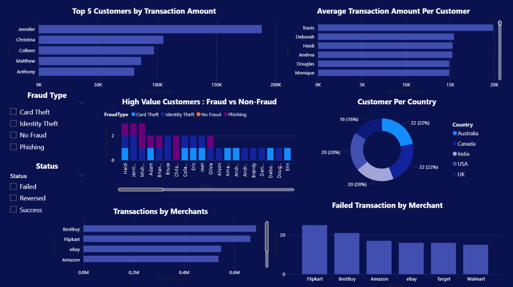
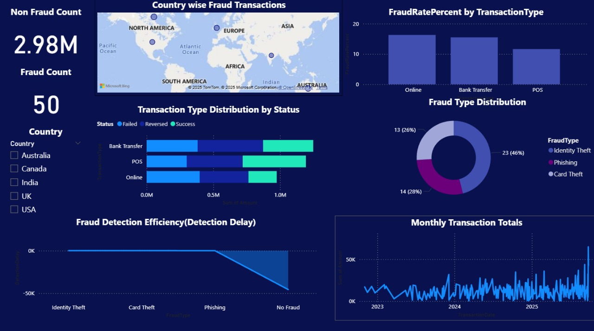
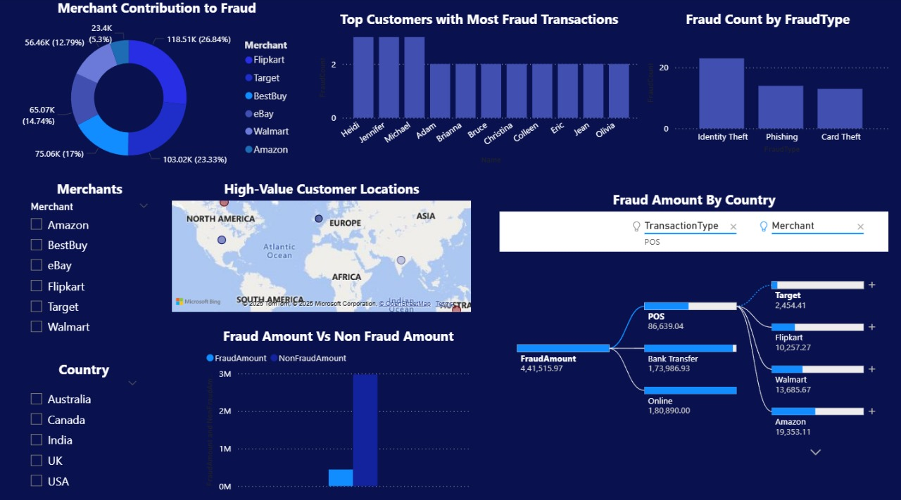

# 🕵️‍♂️ Fraud Detection Analyst System  

## 📌 Project Overview  
This project simulates and analyzes **financial transactions** to detect and prevent fraud using **MySQL** for database management and **Power BI** for visualization.  
It demonstrates how organizations can track suspicious activities, monitor fraud rates, and take preventive actions through data-driven insights.  

---

## 📂 Database Structure  

The project uses **3 main tables**:  

1. **Customers**  
   - `CustomerID`, `Name`, `Email`, `Phone`, `Country`, `AccountCreationDate`  

2. **Transactions**  
   - `TransactionID`, `CustomerID`, `Amount`, `TransactionDate`, `Merchant`, `TransactionType`, `Status`  

3. **FraudFlags**  
   - `TransactionID`, `IsFraud`, `FraudType`, `DetectionDate`  

---

## 🛠️ Problem Statement  
While preparing the dataset, **null values** were identified in:  
- Customer emails  
- Fraud type  
- Detection date  

✅ These were handled using **SQL update queries**, replacing blanks with default values such as `"Unknown"`, `"No Fraud"`, and a placeholder date (`1900-01-01`).  

---

## ⚡ SQL Queries  

### 🔹 Basic Queries  
- Total number of customers  
- Customers by country  
- Transactions by status (Success/Failed)  
- Average transaction amount  

### 🔹 Intermediate Queries  
- Top 5 customers by transaction amount  
- Country-wise fraud transactions  
- Failed transactions by merchant  
- Monthly transaction totals  

### 🔹 Advanced Queries  
- Fraud rate by transaction type  
- High-value customers: Fraud vs Non-Fraud  
- Merchant-wise fraud detection trend  
- Fraud detection efficiency (delay in detection)  

*(Total 20 queries written and executed)*  

---

## 📊 Power BI Visualizations  

The results were visualized in **Power BI dashboards** across **3 pages**:  

1. **Customer & Merchant Analysis**  
   - Customer count, spending patterns, merchant contribution  

2. **Fraud & Risk Analysis**  
   - Fraud type distribution, country-wise fraud, fraud rate %  

3. **High Risk Metrics**  
   - Fraud vs Non-Fraud amounts  
   - Top fraud customers  
   - Fraud detection delays  

---

## 🔑 Key Insights  
- Certain **countries and merchants** show higher fraud activity.  
- Fraud is concentrated in **specific transaction types**.  
- Some customers are **repeat fraud victims**.  
- Fraud detection delays highlight the need for **real-time monitoring**.  

---

## 🚀 Technologies Used  
- **Database:** MySQL  
- **Visualization:** Power BI  
- **Languages:** SQL  

---

## 📌 Conclusion  
This project demonstrates how **SQL + Power BI** can work together for fraud detection.  
Such systems are widely used in **banking, e-commerce, and insurance industries** to identify and prevent fraudulent transactions.  

---

## 🙌 Author  
**Vannamathi B**  
📧 vannamathibaskaran@gmail.com  
 

---

## 📷 Dashboard Preview  
### Page 1: Customer & Merchant Analysis  
  

### Page 2: Fraud & Risk Analysis  
  

### Page 3: High Risk Metrics  

### Page 4: Fraud & High Risk Metrics

